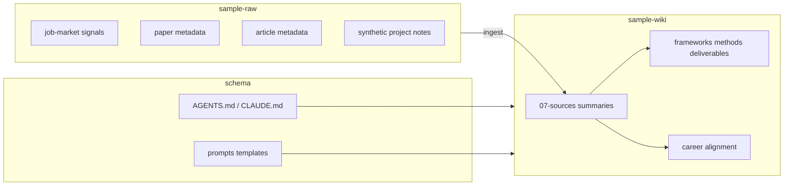

# AI-Assisted Business Analysis Knowledge System

A markdown-based, LLM-maintained Business Analysis knowledge system that transforms public job-market signals, research-paper metadata, articles, and synthetic project notes into a structured wiki of BA frameworks, methods, deliverables, domains, and career-aligned insights.

> **Disclaimer:** This repository contains educational summaries and portfolio samples. It does not include full proprietary source materials, private project notes, or copyrighted job descriptions, articles, or publisher PDFs unless clearly licensed for redistribution. See [docs/privacy-copyright-and-sanitisation.md](docs/privacy-copyright-and-sanitisation.md).

## Project overview

This public portfolio demonstrates how a Business Analyst can design and maintain an **LLM Wiki** — a three-layer knowledge system where:

1. **Raw sources** stay immutable (metadata, signals, synthetic notes).
2. An **LLM-maintained wiki** compiles reusable BA knowledge.
3. A **schema** (`AGENTS.md` / `CLAUDE.md`) governs ingestion, querying, and linting.

The sample content shows job-market signal extraction, research-to-insight synthesis, and structured BA documentation — without exposing private career or business data.

## Problem statement

BA knowledge is often scattered across bookmarks, job ads, articles, meeting notes, and chat history. Summarising sources once in a chat does not create durable, cross-linked, maintainable knowledge. Job-market language, methods, and deliverables drift out of sync with portfolio evidence.

## Solution

Use the **LLM Wiki pattern**:

- Capture **public or synthetic sources** in `sample-raw/`.
- Ingest into **source summaries** under `sample-wiki/07-sources/`.
- Integrate insights into **framework, method, deliverable, domain, and career pages**.
- Maintain `index.md` and `log.md` as navigation and audit trail.
- Run periodic **lint** checks for stale claims, orphans, and gaps.

## Architecture: raw sources → wiki → schema



| Layer | Role | Folder |
|---|---|---|
| Raw | Immutable capture; metadata-first | `sample-raw/` |
| Wiki | Synthesised, cross-linked BA knowledge | `sample-wiki/` |
| Schema | Rules for agents and humans | `AGENTS.md`, `CLAUDE.md`, `prompts/`, `templates/` |

## Folder structure

```
ba-knowledge-system-portfolio/
├── README.md
├── docs/                    # System documentation
├── sample-raw/              # Public metadata & synthetic sources only
├── sample-wiki/             # LLM-maintained sample wiki
├── prompts/                 # Agent prompt templates
├── templates/               # Page and source templates
├── AGENTS.md                # Agent schema (public)
├── CLAUDE.md                # Agent schema (public)
├── LICENSE
└── .gitignore
```

## Source selection policy

Only include materials that are:

- **Public** — career guides, explainers, citation metadata with DOI/URL.
- **Synthetic** — clearly labelled fictional project notes for demonstration.
- **Summarised in own words** — no full JD text, no publisher PDFs, no paywalled article body.

See [docs/source-selection-policy.md](docs/source-selection-policy.md).

## Sample ingest workflow

1. Add a source file to `sample-raw/` (metadata or synthetic note).
2. Run the ingest prompt: [prompts/ingest-source.md](prompts/ingest-source.md).
3. Create or update a source summary in `sample-wiki/07-sources/`.
4. Update relevant wiki pages (methods, deliverables, career).
5. Append `sample-wiki/log.md` and refresh `sample-wiki/index.md`.

Documented in [docs/ingest-workflow.md](docs/ingest-workflow.md).

## Sample query workflow

1. Read `sample-wiki/index.md`.
2. Open relevant wiki pages (not isolated chunks).
3. Synthesise an answer; separate fact from interpretation.
4. File reusable answers to `sample-wiki/` if appropriate.

Documented in [docs/query-workflow.md](docs/query-workflow.md).

## Sample lint workflow

Periodically check for stale claims, duplicate pages, orphan links, missing cross-references, and portfolio gaps. Store reports in `sample-wiki/09-maintenance/`.

Documented in [docs/lint-workflow.md](docs/lint-workflow.md). Example: [sample-wiki/09-maintenance/sample-lint-report.md](sample-wiki/09-maintenance/sample-lint-report.md).

## BA skills demonstrated

| Skill area | Evidence in this repo |
|---|---|
| Knowledge architecture | Three-layer LLM Wiki design |
| Requirements thinking | [[requirements-analysis]] sample method page |
| Stakeholder analysis | [[stakeholder-analysis]] sample method page |
| Process mapping | [[process-mapping]] sample method page |
| Change impact | [[change-impact-analysis]] sample method page |
| Deliverable design | Dashboard spec, KPI dictionary, user stories, UAT plan |
| Job-market alignment | [[role-taxonomy]], [[keyword-bank]] from public signals |
| Research synthesis | Hospitality AI paper metadata → BA implications |
| Digital transformation | McKinsey-style framework summary (own words) |
| Documentation governance | Privacy policy, ingest/log/index maintenance |

## Tools used

- **Markdown** — portable wiki format
- **Obsidian** — optional local navigation with `[[wiki-links]]`
- **LLM agents** (Cursor, Claude, etc.) — ingestion and synthesis under schema rules
- **Git / GitHub** — version control and public portfolio hosting

## Privacy and copyright note

This public repo is a **sanitised portfolio slice**. Private vaults may contain personal project evidence, work authorisation details, and full clips — those stay offline. This repo uses:

- Job-market **signals** (not full job ads)
- Paper **citation metadata and paraphrased summaries** (not publisher PDFs)
- Article **metadata and paraphrased concepts** (not full McKinsey text)
- **Synthetic** project notes for deliverable examples

Full policy: [docs/privacy-copyright-and-sanitisation.md](docs/privacy-copyright-and-sanitisation.md).

## Limitations

- Sample wiki is illustrative, not a production knowledge base.
- Job-market signals are point-in-time and market-specific (Australia-oriented examples).
- Synthetic project does not represent real client or employer work.
- LLM-generated synthesis requires human review for accuracy and bias.
- No live automation pipeline — workflows are documented for agent-assisted manual runs.

## Future improvements

- Add CI lint script for broken `[[wiki-links]]` and required frontmatter.
- Add more public source types: BABOK study notes, open Agile guides.
- Add `05-projects/` with additional synthetic case studies.
- Publish Obsidian publish / MkDocs site from `sample-wiki/`.
- Add example GitHub Action for scheduled lint reports.

## Quick start

```bash
git clone https://github.com/<your-username>/ba-knowledge-system-portfolio.git
cd ba-knowledge-system-portfolio
# Open in Obsidian, VS Code, or Cursor; read sample-wiki/index.md
```

## License

MIT License — see [LICENSE](LICENSE). Third-party sources retain their own copyrights; this repo redistributes only permitted metadata and original summaries.
